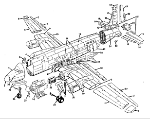

# Progettino C++


### **Introduzione**

Ho voluto provare a studiare un nuovo design pattern ed applicarlo al linguaggio C++.

Ho scelto il pattern Builder: è un pattern creazionale che permette di costruire oggetti complessi step by step.

**Problema:** voglio creare un oggetto costruito mediante l’unione di altri numerosi oggetti complessi che hanno dipendenze l’uno con l’altro.

Esempio: Aereo → Motore, ali, coda, …

Voglio costruire questo oggetto un passo alla volta. Voglio evitare di usare un costruttore enorme costituito da tantissimi parametri.

**Soluzione:** Il pattern Builder suggerisce di portare la parte di codice addetta alla costruzione dell’oggetto fuori dalla sua classe e spostarla in oggetti separati chiamati **builders**.


<table>
  <tr>
   <td>PlaneBuilder
   </td>
  </tr>
  <tr>
   <td>...
   </td>
  </tr>
  <tr>
   <td>+buildBody()
<p>
+buildEngine()
<p>
+buildTail()
<p>
....
   </td>
  </tr>
</table>




Il pattern organizza la costruzione dell’oggetto in una serie di passi (buildBody, buildEngine, etc). Per creare un oggetto, viene mandato in esecuzione un elenco di questi passi all’interno di un oggetto Builder. 

**Nota:** Non è necessario chiamare _tutti_ i passi per produrre una particolare configurazione di un oggetto.

Posso quindi avere differenti implementazioni della stessa parte di oggetto.

Esempio: Motore → motore a reazione oppure motore a elica

In questi casi è possibile scrivere differenti versioni di builder che implementino lo stesso elenco di passi da seguire, ma che siano specializzati in modo differente.

Per gestire al meglio queste versioni diverse di Builder è necessario avere una classe Direttore che gestisca la costruzione dell’oggetto, garantendo il corretto ordine di costruzione delle parti che costituiscono l’oggetto. \
 \
Per ogni versione diversa dell’oggetto c’è un builder diverso che viene chiamato dal direttore.

Inoltre, la classe Direttore nasconde completamente i dettagli di costruzione di uno specifico prodotto. L’utilizzatore deve solo associare un builder con un direttore, eseguire la costruzione tramite un direttore e ottenere il risultato finale.


### **Struttura**


1. L’interfaccia Builder dichiara i passi costruttivi che sono in comune con tutti i tipi di builders. 

    ```
    //"Abstract" Class
    class PlaneBuilder {
    public:
        //costruttore
        PlaneBuilder();
        //distruttore
        virtual ~PlaneBuilder();
        //metodi astratti
        virtual void getPartsDone() = 0;
        virtual void buildBody() = 0;
        virtual void buildEngine() = 0;
        Aereo* getAereo();
    protected:
        Aereo *_aereo;
    };
    ```


2. I Builder concreti forniscono diverse implementazioni del passo costruttivo. Ovviamente, i Builder concreti potrebbero creare prodotti che non seguono pari pari l’interfaccia.
3. I Prodotti sono gli oggetti risultato dei Builder concreti. Non devo appartenere necessariamente alla stessa gerarchia di classi.
4. La classe Director definisce l’ordine di chiamata dei metodi di Builder. In questo modo è possibile creare e riutilizzare specifiche configurazioni di prodotti.

    ```
    Aereo* Director::creaAereo(PlaneBuilder *builder) {
       		builder->getPartsDone();
        		builder->buildBody();
        		builder->buildEngine();
        		return builder->getAereo();
    }
    ```


5. Il Client deve associare uno dei builder ad un direttore.


### **Struttura Progetto**

L’intero progetto è stato diviso in due cartelle: **include** che contiene gli header files e **source** contenente i file di implementazione con estensione .cpp

Il codice implementa, come già detto, il Builder pattern. Gli oggetti da costruire sono degli **aerei**. Ho strutturato la gerarchia delle classi, predisponendo il sistema a possibili ampliamenti.


Ho creato una classe base **MezzoTrasporto** che viene estesa privatamente da **Aereo**. In questo modo ho usato l’**ereditarietà privata**. 

Inoltre possiede il **campo privato** _str che contiene l’id dell’oggetto. \
Il suo distruttore è **virtual**, in questo modo sono sicuro che venga chiamato il distruttore dello stesso tipo dell’istanza chiamante.

Inoltre, possiede i metodi metodoOverload(int)/metodoOverload(string) per mostrare l’**overloading**. \


Aereo **non** è sottotipo di MezzoTrasporto. Quindi i metodi pubblici di MezzoTrasporto è come se fossero privati per Aereo. Quindi il metodo show() di Aereo non è override del metodo show() di MezzoTrasporto. 

Il distruttore di Aereo è **virtual**, in questo modo sono sicuro che venga chiamato anche il distruttore degli eventuali sottotipi.

**AereoCombattimento **estende pubblicamente Aereo: è sottotipo. Possiede un campo privato composto da una lista (uso **list **della **STL**) ed esegue **override** del metodo show().
