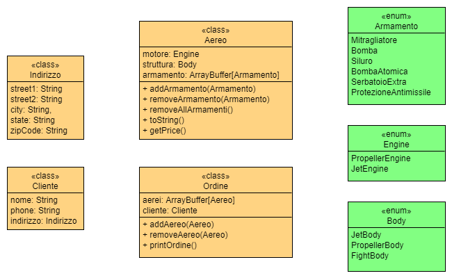

# Progettino SCALA

### **Introduzione**

Il progetto usa di nuovo l’idea di creazione di aerei di diverso tipo.

In questo caso specifico realizzo un programmino per la creazione di ordini di produzione.

Un **ordine **associa un **cliente **(a cui è associato un **indirizzo**)** **ad un array di **aerei**. 

Un aereo è costituito da un **motore**, un **corpo **e una lista di optional chiamata **armamento**.

I possibili componenti dell’aereo sono realizzati tramite degli enumerativi,  codificati utilizzando delle **sealed trait**: Armamento, Engine e Body.

Nel main creo diversi aerei, testo i metodi delle varie classi, creo un cliente e un ordine.

### **Diagramma delle classi** 

Il metodo getPrice() della classe Aereo è dichiarato = ???. Equivale a dichiarare un metodo astratto, quindi che è presente, ma il cui corpo dovrà essere implementato.

Il metodo toString di Aereo esegue un override della classe object.
